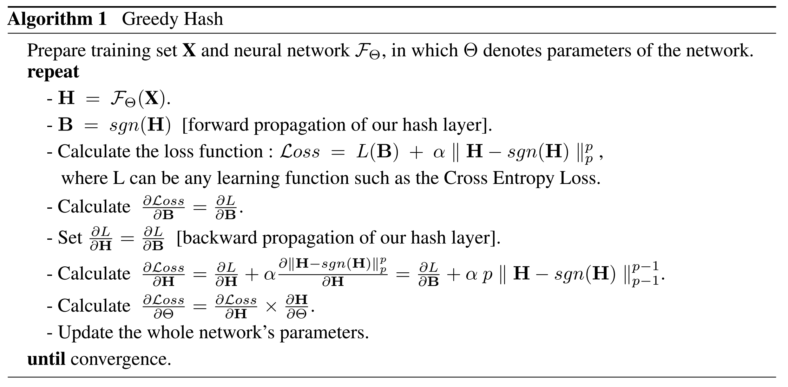

# 基于 PaddlePaddle 实现 GreedyHash(NeurIPS2018)

[English](./README_en.md) | 简体中文
   
   * [paddle_greedyhash](#基于-paddlepaddle-实现-greedyhashneurips2018)
      * [一、简介](#一简介)
      * [二、复现精度](#二复现精度)
      * [三、数据集](#三数据集)
      * [四、环境依赖](#四环境依赖)
      * [五、快速开始](#五快速开始)
         * [step1: 下载本项目及训练权重](#step1-下载本项目及训练权重)
         * [step2: 修改参数](#step2-修改参数)
         * [step3: 验证模型](#step3-验证模型)
         * [step4: 训练模型](#step4-训练模型)
         * [step5: 验证预测](#step5-验证预测)
      * [六、TIPC](#六tipc)
      * [七、代码结构与详细说明](#七代码结构与详细说明)
      * [八、模型信息](#八模型信息)
      * [九、参考及引用](#九参考及引用)

- 原论文：[Greedy Hash: Towards Fast Optimization for Accurate Hash Coding in CNN](https://papers.nips.cc/paper/7360-greedy-hash-towards-fast-optimization-for-accurate-hash-coding-in-cnn.pdf).

- 官方原版代码（基于PyTorch）[GreedyHash](https://github.com/ssppp/GreedyHash).

- 第三方参考代码（基于PyTorch）[DeepHash-pytorch](https://github.com/swuxyj/DeepHash-pytorch).

## 一、简介

GreedyHash 意在解决**图像检索 Deep Hashing** 领域中NP优化难的问题，为此，作者在每次迭代中向可能的最优离散解迭代式更新网络参数。具体来说，GreedyHash 在网络模型中加入了一个哈希编码层，在前向传播过程中为了保持离散的限制条件，严格利用sign函数。在反向传播过程中，梯度完整地传向前一层，进而可以避免梯度弥散现象。算法伪代码如下。

<p align="center">

    <h4 align="center">GreedyHash 算法伪代码</h4>
</p>

## 二、复现精度

|      | Framework | 12bits | 24bits | 32bits | 48bits|
|  ----  |  ----  |  ----  |  ----  |  ----  |  ----  |
| 论文结果  | PyTorch |  0.774  |  0.795  |  0.810  |  0.822  |
| 重跑结果  | PyTorch |  0.789  |  0.799  |  0.813  |**0.824**|
| 复现结果  | PaddlePaddle  |**0.798**|**0.809**|**0.817**|  0.819(**0.824**)  |

- 需要注意的是，此处在重跑PyTorch版本代码时发现原论文代码 [GreedyHash/cifar1.py](https://github.com/ssppp/GreedyHash/blob/master/cifar1.py) 由于PyTorch版本较老，CIFAR-10 数据集处理部分代码无法运行，遂将第三方参考代码 [DeepHash-pytorch](https://github.com/swuxyj/DeepHash-pytorch) 中的 CIFAR-10 数据集处理部分代码照搬运行，得以重跑PyTorch版本代码，结果罗列如上。严谨起见，已将修改后的PyTorch版本代码及训练日志放在 [pytorch_greedyhash/main.py](pytorch_greedyhash/main.py) 和 [pytorch_greedyhash/logs](pytorch_greedyhash/logs) 中。因为跑的时候忘记设置随机数种子了，复现的时候可能结果有所偏差，不过应该都在可允许范围内，问题不大。

- 本项目（基于 PaddlePaddle ）依次跑 12/24/32/48 bits 的结果罗列在上表中，且已将训练得到的模型参数与训练日志 log 存放于[output](output)文件夹下。由于训练时设置了随机数种子，理论上是可复现的。但在反复重跑几次发现结果还是会有波动，比如有1次 **48bits** 的模型跑到了 **0.824**，我把对应的 log 和权重放在 [output/bit48_alone](output/bit48_alone) 路径下了，说明算法的随机性仍然存在。

## 三、数据集
cifar-1（即CIFAR-10 (I)）

- CIFAR-10 数据集共10类，由 60,000 个 32×32 的彩色图像组成。

- CIFAR-10 (I)中，选择 1000 张图像（每类 100 张图像）作为查询集，其余 59,000 张图像作为数据库， 而从数据库中随机采样 5,000 张图像（每类 500 张图像）作为训练集。数据集处理代码详见 [utils/datasets.py](utils/datasets.py)。

## 四、环境依赖

本人环境配置：

- Python: 3.7.11
- [PaddlePaddle](https://www.paddlepaddle.org.cn/documentation/docs/en/install/index_en.html): 2.2.2
- 硬件：NVIDIA 2080Ti * 1

    <small>*p.s. 因为数据集很小，所以放单卡机器上跑了，多卡的代码可能后续补上*</small>

## 五、快速开始

### step1: 下载本项目及训练权重

```
git clone https://github.com/hatimwen/paddle_greedyhash.git
cd paddle_greedyhash
```

- 由于权重比较多，加起来有 1 个 GB ，因此我放到百度网盘里了，烦请下载后按照 [六、代码结构与详细说明](#六代码结构与详细说明) 排列各个权重文件。

- 下载链接：[BaiduNetdisk](https://pan.baidu.com/s/1-90a8HEEHM4zmqk5T6DCrQ), 提取码: tl1i 。

### step2: 修改参数

请根据实际情况，修改 [scripts](./scripts/) 中想运行脚本的配置内容（如：data_path, batch_size等）。

### step3: 验证模型

- **注意**：需要提前下载并排列好 [BaiduNetdisk](https://pan.baidu.com/s/1-90a8HEEHM4zmqk5T6DCrQ) 中的各个预训练模型。

```
sh scripts/test.sh
```

### step4: 训练模型

```
sh scripts/train.sh
```

### step5: 验证预测

```
python predict.py \
--bit 48 \
--pic_id 1949
```

<p align="center">

    <h4 align="center">验证图片（类别：飞机 airplane， id: 0）</h4>
</p>

输出结果为:

```
----- Pretrained: Load model state from output/bit_48.pdparams
----- Predicted Class_ID: 0, Prob: 0.9965014457702637, Real Label_ID: 0
----- Predicted Class_NAME: 飞机 airplane, Real Class_NAME: 飞机 airplane
```

显然，预测结果正确。

## 六、TIPC

- 本项目为 12/24/32/48 bits 分别写了对应的 TIPC 配置文件， 均位于 [test_tipc/configs](test_tipc/configs/) 文件夹下；另外方便起见， [scripts/tipc.sh](scripts/tipc.sh) 是一个直接跑所有 bits 的脚本。

- 详细日志放置在 [test_tipc/output](test_tipc/output/) 目录下；

- 具体 TIPC 介绍及使用流程请参阅：[test_tipc/README.md](test_tipc/README.md)。

## 七、代码结构与详细说明

```
|-- paddle_greedyhash
    |-- deploy
        |-- inference_python
            |-- infer.py            # TIPC 推理代码
            |-- README.md           # TIPC 推理流程介绍
    |-- output              # 日志及模型文件
        |-- bit48_alone         # 偶然把bit48跑到了0.824，日志和权重存于此
            |-- bit_48.pdparams     # bit48_alone的模型权重
            |-- log_48.txt          # bit48_alone的训练日志
        |-- bit_12.pdparams     # 12bits的模型权重
        |-- bit_24.pdparams     # 24bits的模型权重
        |-- bit_32.pdparams     # 32bits的模型权重
        |-- bit_48.pdparams     # 48bits的模型权重
        |-- log_eval.txt        # 用训练好的模型测试日志（包含bit48_alone）
        |-- log_train.txt       # 依次训练 12/24/32/48 bits（不包含bit48_alone）
    |-- models
        |-- __init__.py
        |-- alexnet.py      # AlexNet 定义，注意这里有略微有别于 paddle 集成的 AlexNet
        |-- greedyhash.py   # GreedyHash 算法定义
    |-- test_tipc               # 飞桨训推一体认证（TIPC）
    |-- utils
        |-- datasets.py         # dataset, dataloader, transforms
        |-- lr_scheduler.py     # 学习率策略定义
        |-- tools.py            # mAP, acc计算；随机数种子固定函数
    |-- eval.py             # 单卡测试代码
    |-- export_model.py     # 模型动态转静态代码
    |-- predict.py          # 预测演示代码
    |-- train.py            # 单卡训练代码
    |-- README.md
    |-- pytorch_greedyhash
        |-- datasets.py         # PyTorch 定义dataset, dataloader, transforms
        |-- cal_map.py          # PyTorch mAP计算；
        |-- main.py             # PyTorch 单卡训练代码
        |-- output              # PyTorch 重跑日志
```

## 八、模型信息

关于模型的其他信息，可以参考下表：

| 信息 | 说明 |
| --- | --- |
| 发布者 | 文洪涛 |
| Email | hatimwen@163.com |
| 时间 | 2022.04 |
| 框架版本 | Paddle 2.2.2 |
| 应用场景 | 图像检索 |
| 支持硬件 | GPU、CPU |
| 下载链接 | [预训练模型 提取码: tl1i](https://pan.baidu.com/s/1-90a8HEEHM4zmqk5T6DCrQ)  |
| 在线运行 | [AI Studio](https://aistudio.baidu.com/aistudio/projectdetail/1945560)|
| License | [Apache 2.0 license](LICENCE)|
## 九、参考及引用

```
@article{su2018greedy,
  title={Greedy hash: Towards fast optimization for accurate hash coding in cnn},
  author={Su, Shupeng and Zhang, Chao and Han, Kai and Tian, Yonghong},
  year={2018},
  journal={Advances in Neural Information Processing Systems},
  volume={31},
  year={2018}
}
```

- [PaddlePaddle](https://github.com/paddlepaddle/paddle)

最后，非常感谢百度举办的[飞桨论文复现挑战赛（第六期）](https://aistudio.baidu.com/aistudio/competition/detail/205/0/introduction)让本人对 PaddlePaddle 理解更加深刻。
