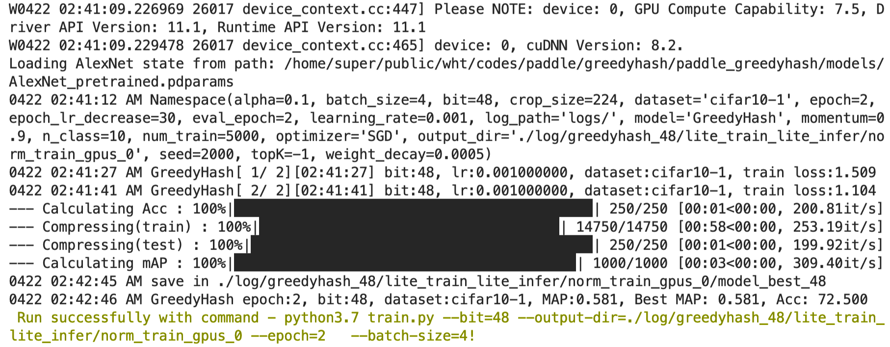
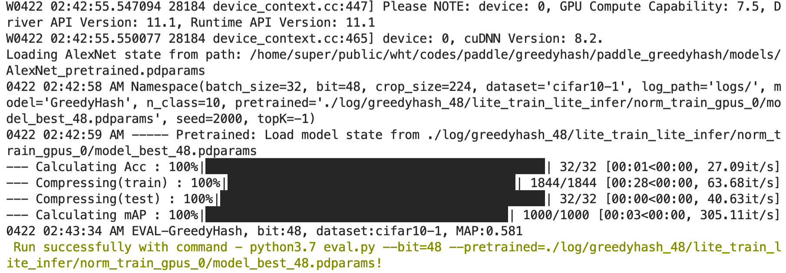
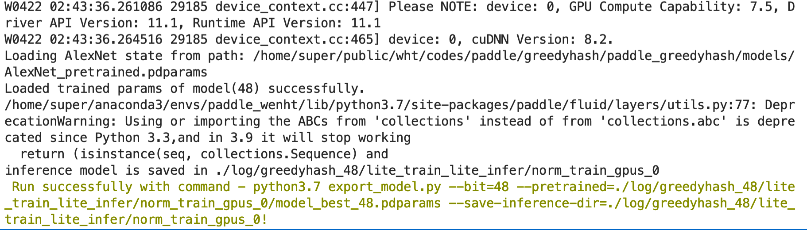
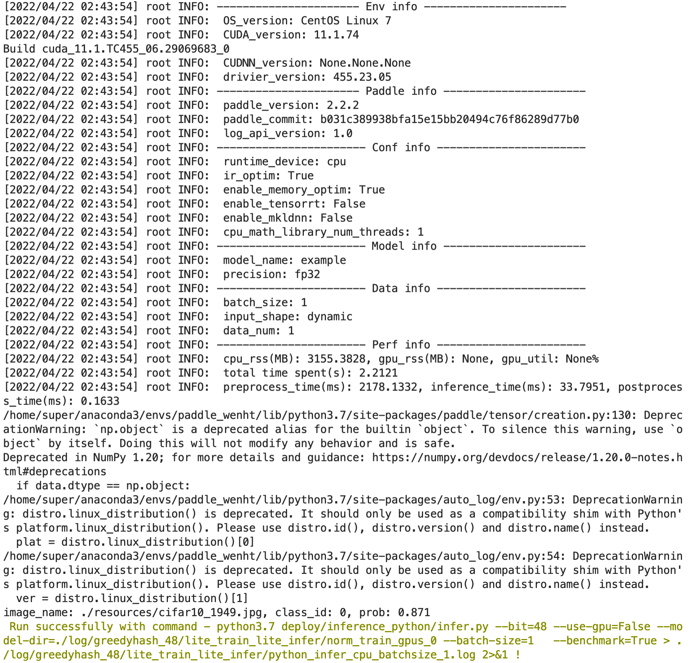

# Linux GPU/CPU 基础训练推理测试

Linux GPU/CPU 基础训练推理测试的主程序为`test_train_inference_python.sh`，可以测试基于Python的模型训练、评估、推理等基本功能。

## 1. 测试结论汇总

- 训练相关：

| 算法名称 | 模型名称 | 单机单卡 | 单机多卡 |
|  :----: |   :----:  |    :----:  |  :----:   |
|  GreedyHash  | greedyhash_12 | 正常训练 | - |
|  GreedyHash  | greedyhash_24 | 正常训练 | - |
|  GreedyHash  | greedyhash_32 | 正常训练 | - |
|  GreedyHash  | greedyhash_48 | 正常训练 | - |


- 推理相关：

| 算法名称 | 模型名称 | device_CPU | device_GPU | batchsize |
|  :----:   |  :----: |   :----:   |  :----:  |   :----:   |
|  GreedyHash   |  greedyhash_12 |  支持 | 支持 | 1 |
|  GreedyHash   |  greedyhash_24 |  支持 | 支持 | 1 |
|  GreedyHash   |  greedyhash_32 |  支持 | 支持 | 1 |
|  GreedyHash   |  greedyhash_48 |  支持 | 支持 | 1 |


## 2. 测试流程

### 2.1 准备数据

由于是 cifar10 数据集，在 [utils/datasets.py](utils/datasets.py) 由 `paddle.vision.datasets.Cifar10` 相关类实现了数据下载等工作，因此不用人为准备，略过即可。

### 2.2 准备环境


- 安装PaddlePaddle：如果您已经安装了2.2或者以上版本的paddlepaddle，那么无需运行下面的命令安装paddlepaddle。
    ```
    # 需要安装2.2及以上版本的Paddle
    # 安装GPU版本的Paddle
    pip install paddlepaddle-gpu==2.2.0
    # 安装CPU版本的Paddle
    pip install paddlepaddle==2.2.0
    ```

- 安装AutoLog（规范化日志输出工具）
    ```
    pip install  https://paddleocr.bj.bcebos.com/libs/auto_log-1.2.0-py3-none-any.whl
    ```

### 2.3 功能测试


测试方法如下所示，希望测试不同的模型文件，只需更换为自己的参数配置文件，即可完成对应模型的测试。

```bash
bash test_tipc/test_train_inference_python.sh ${your_params_file} lite_train_lite_infer
```

以`greedyhash_48`的`Linux GPU/CPU 基础训练推理测试`为例，命令如下所示。

```bash
bit=48
bash test_tipc/test_train_inference_python.sh \
test_tipc/configs/greedyhash_$bit/train_infer_python.txt \
lite_train_lite_infer
```

log中输出结果如下，表示命令运行成功。

```bash
Run successfully with command - python3.7 train.py --bit=48 --output-dir=./log/greedyhash_48/lite_train_lite_infer/norm_train_gpus_0 --epoch=2   --batch-size=4!  
Run successfully with command - python3.7 eval.py --bit=48 --pretrained=./log/greedyhash_48/lite_train_lite_infer/norm_train_gpus_0/model_best_48.pdparams!  
Run successfully with command - python3.7 export_model.py --bit=48 --pretrained=./log/greedyhash_48/lite_train_lite_infer/norm_train_gpus_0/model_best_48.pdparams --save-inference-dir=./log/greedyhash_48/lite_train_lite_infer/norm_train_gpus_0!  
Run successfully with command - python3.7 deploy/inference_python/infer.py --bit=48 --use-gpu=True --model-dir=./log/greedyhash_48/lite_train_lite_infer/norm_train_gpus_0 --batch-size=1   --benchmark=True > ./log/greedyhash_48/lite_train_lite_infer/python_infer_gpu_batchsize_1.log 2>&1 !  
Run successfully with command - python3.7 deploy/inference_python/infer.py --bit=48 --use-gpu=False --model-dir=./log/greedyhash_48/lite_train_lite_infer/norm_train_gpus_0 --batch-size=1   --benchmark=True > ./log/greedyhash_48/lite_train_lite_infer/python_infer_cpu_batchsize_1.log 2>&1 !  

```

TIPC结果：

<div align="center">
    
</div>
<div align="center">
    
</div>
<div align="center">
    
</div>
<div align="center">
    
</div>
<div align="center">
    
</div>
